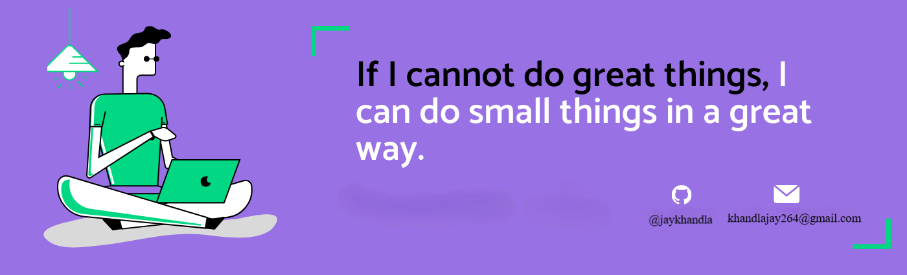

<h1 align="center">Hello I'm Jay Khandla</h1>
 

    

  

## 👨🏻‍💻 About Me:

- 🙋‍♂️ All about me is at [My Website](https://jay-flame.vercel.app/)

- 🔭 I’m currently working on `Something Intresting`.

- 👯 I’m looking to collaborate for `Dev Projects`

- 👨‍💻 Life Hack: Keep Learning :fire:

                 
 
## 🛠️ Technologies and Tools I use:

## ❤️ Let's get connected:

  
